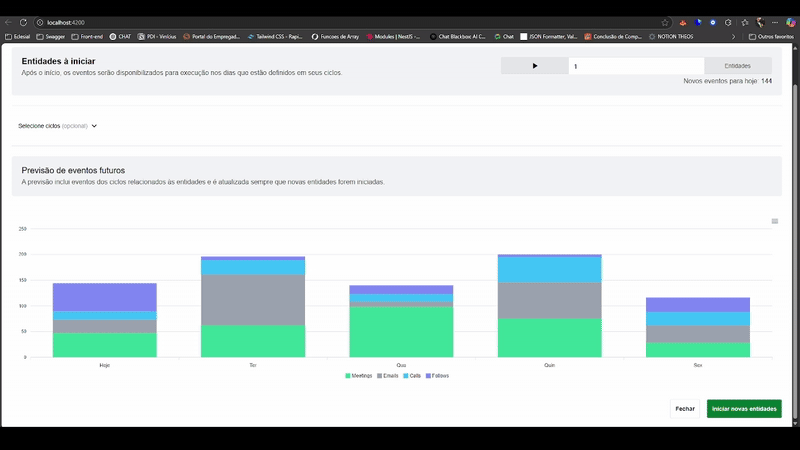

# ProjectMeetime

# Project Meetime

Este é um projeto Angular 19 com suporte a Server-Side Rendering (SSR), gráficos usando ApexCharts, estilização com TailwindCSS, e backend em Express.

## 📦 Tecnologias utilizadas

- Angular ^19.2
- Angular Material
- ApexCharts + ng-apexcharts
- TailwindCSS
- Express (para SSR)
- RxJS, Zone.js
- TypeScript

---

## ⚙️ Pré-requisitos

- Node.js >= 18
- Angular CLI (`npm install -g @angular/cli`)

---

## 🚀 Instalação

Clone o repositório:

```bash
git clone https://github.com/seu-usuario/project-meetime.git
cd project-meetime

```

## 📽️ Apresentação do Projeto

Abaixo está uma demonstração rápida da interface e comportamento do sistema em tempo real:

<div class="flex items-center">
  
</div>
